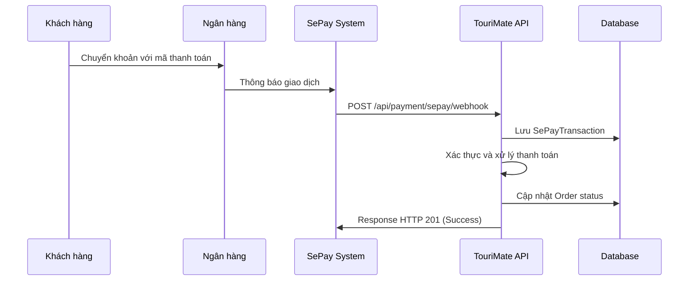

# TouriMate SePay Integration

## Tổng quan

Tài liệu này mô tả việc tích hợp SePay vào hệ thống TouriMate để xử lý thanh toán tự động thông qua webhook notifications.

## Kiến trúc tích hợp

### 1. Components đã tạo

#### Models
- **SePayTransaction**: Model lưu trữ thông tin giao dịch từ SePay
- **SePayWebhookRequest/Response**: DTOs cho việc giao tiếp với SePay webhook

#### Services
- **ISePayService**: Interface định nghĩa các phương thức xử lý SePay
- **SePayService**: Implementation xử lý logic webhook và thanh toán

#### Controllers
- **PaymentController**: Controller xử lý các request liên quan đến thanh toán

### 2. Workflow tích hợp



## Cấu hình SePay

### 1. Webhook Configuration

Trong SePay dashboard, cấu hình webhook với các thông tin sau:

- **URL**: `https://yourdomain.com/api/payment/sepay/webhook`
- **Events**: Chọn "Có tiền vào" hoặc "Cả hai"
- **Authentication**: Có thể sử dụng API Key hoặc không cần xác thực
- **Retry Policy**: SePay sẽ retry tối đa 7 lần trong 5 giờ

### 2. Payment Code Format

Hệ thống hỗ trợ các format mã thanh toán:
- `TT{OrderNumber}`: Ví dụ TT12345678
- `ORDER{OrderNumber}`: Ví dụ ORDER12345678
- `PAY{OrderNumber}`: Ví dụ PAY12345678

### 3. Bank Account Configuration

Cần cấu hình tài khoản ngân hàng trong SePay để nhận thông báo giao dịch.

## API Endpoints

### 1. SePay Webhook

```http
POST /api/payment/sepay/webhook
Content-Type: application/json

{
    "id": 92704,
    "gateway": "Vietcombank",
    "transactionDate": "2023-03-25 14:02:37",
    "accountNumber": "0123499999",
    "code": "TT12345678",
    "content": "chuyen tien mua tour TT12345678",
    "transferType": "in",
    "transferAmount": 2277000,
    "accumulated": 19077000,
    "referenceCode": "MBVCB.3278907687",
    "description": "Toàn bộ nội dung tin nhắn SMS"
}
```

**Response Success (HTTP 201):**
```json
{
    "success": true,
    "message": "Payment processed successfully",
    "transactionId": "guid",
    "orderId": "guid",
    "processedAt": "2023-03-25T14:02:37Z"
}
```

**Response Error (HTTP 400):**
```json
{
    "success": false,
    "message": "No related order found"
}
```

### 2. Payment Instructions

```http
GET /api/payment/instructions/{orderId}
```

### 3. Payment Status

```http
GET /api/payment/status/{orderId}
```

## Database Schema

### SePayTransactions Table

| Column | Type | Description |
|--------|------|-------------|
| Id | Guid | Primary key |
| SePayTransactionId | int | ID giao dịch từ SePay |
| Gateway | string(100) | Tên ngân hàng |
| TransactionDate | DateTime | Thời gian giao dịch |
| AccountNumber | string(20) | Số tài khoản |
| Code | string(50) | Mã thanh toán |
| Content | string(max) | Nội dung chuyển khoản |
| TransferType | string(10) | "in" hoặc "out" |
| TransferAmount | decimal(18,2) | Số tiền giao dịch |
| Accumulated | decimal(18,2) | Số dư tài khoản |
| EntityId | Guid | ID đơn hàng/booking liên quan |
| EntityType | string(20) | "Order" hoặc "Booking" |
| ProcessingStatus | string(20) | "pending", "processed", "failed" |
| ProcessedAt | DateTime | Thời gian xử lý |

## Security Considerations

### 1. Webhook Validation

- Validate dữ liệu đầu vào từ SePay
- Kiểm tra duplicate transactions
- Log tất cả webhook requests

### 2. Payment Processing

- Xác thực mã thanh toán
- Kiểm tra số tiền chuyển khoản
- Tránh xử lý duplicate payments

### 3. Error Handling

- Retry mechanism cho failed payments
- Logging chi tiết cho debugging
- Graceful handling của network failures

## Testing

### 1. Sandbox Environment

Sử dụng tài khoản demo tại `my.dev.sepay.vn` để test:
- Tạo giao dịch giả lập
- Test webhook integration
- Verify payment processing

### 2. Test Cases

1. **Valid Payment**: Giao dịch hợp lệ với mã thanh toán đúng
2. **Invalid Payment Code**: Giao dịch không có mã thanh toán
3. **Duplicate Transaction**: Giao dịch đã được xử lý
4. **Money Out**: Giao dịch tiền ra (không xử lý)
5. **Partial Payment**: Thanh toán không đủ số tiền
6. **Network Failure**: Xử lý khi webhook fail

## Monitoring & Logging

### 1. Logs

- Tất cả webhook requests được log
- Payment processing results
- Error conditions và exceptions

### 2. Metrics

- Số lượng webhook nhận được
- Tỷ lệ thành công/thất bại
- Thời gian xử lý trung bình

### 3. Alerts

- Webhook failures
- Payment processing errors
- Duplicate transaction attempts

## Deployment

### 1. Environment Variables

```bash
# SePay Configuration
SEPAY_WEBHOOK_URL=https://yourdomain.com/api/payment/sepay/webhook
SEPAY_API_KEY=your_api_key_here

# Database
CONNECTION_STRING=your_connection_string
```

### 2. Migration

```bash
dotnet ef database update
```

### 3. Health Checks

- Webhook endpoint availability
- Database connectivity
- SePay service status

## Troubleshooting

### 1. Common Issues

**Webhook không nhận được:**
- Kiểm tra URL webhook trong SePay dashboard
- Verify network connectivity
- Check firewall settings

**Payment không được xử lý:**
- Kiểm tra mã thanh toán format
- Verify order tồn tại trong database
- Check processing logs

**Duplicate payments:**
- Kiểm tra duplicate detection logic
- Verify SePayTransactionId uniqueness

### 2. Debug Commands

```bash
# Check recent webhook logs
SELECT * FROM SePayTransactions ORDER BY CreatedAt DESC LIMIT 10;

# Check failed payments
SELECT * FROM SePayTransactions WHERE ProcessingStatus = 'failed';

# Check order payment status
SELECT o.OrderNumber, o.PaymentStatus, spt.ProcessingStatus 
FROM Orders o 
LEFT JOIN SePayTransactions spt ON o.Id = spt.EntityId 
WHERE o.Id = 'order-id';
```

## Roadmap

### Phase 1 (Completed)
- ✅ Basic webhook integration
- ✅ Payment processing logic
- ✅ Database schema
- ✅ Error handling

### Phase 2 (Future)
- 🔄 Enhanced payment code formats
- 🔄 Multiple bank account support
- 🔄 Payment reconciliation reports
- 🔄 Admin dashboard for payment monitoring

### Phase 3 (Future)
- 📋 Advanced fraud detection
- 📋 Automated refund processing
- 📋 Integration with other payment gateways
- 📋 Real-time payment notifications

## Support

Để được hỗ trợ về tích hợp SePay:

1. **Documentation**: [SePay Docs](https://docs.sepay.vn/tich-hop-webhooks.html)
2. **Support**: Liên hệ SePay support team
3. **Issues**: Tạo issue trong project repository
